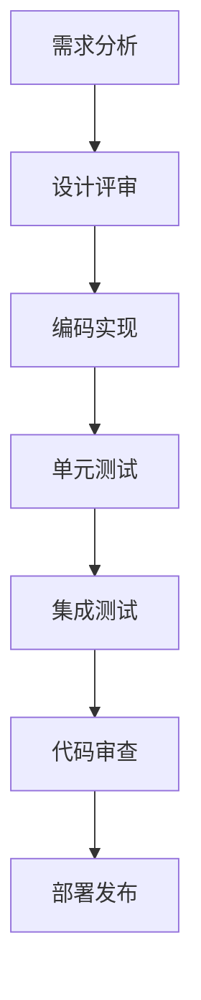

# 开发指南

## 概述

本指南为谁是珠王微信小游戏项目的开发者提供详细的开发流程、编码规范、调试技巧和最佳实践。

## 目录

- [环境搭建](#环境搭建)
- [项目结构](#项目结构)
- [开发流程](#开发流程)
- [编码规范](#编码规范)
- [调试技巧](#调试技巧)
- [测试指南](#测试指南)
- [部署流程](#部署流程)
- [常见问题](#常见问题)

---

## 环境搭建

### 1. 必需工具

- **微信开发者工具**: 最新版本
- **Node.js**: v14.0.0 或更高版本
- **TypeScript**: v4.0.0 或更高版本
- **Git**: 版本控制

### 2. 开发环境配置

#### 安装依赖

```bash
# 安装项目依赖
npm install

# 安装开发依赖
npm install --save-dev @types/node typescript jest @types/jest ts-jest
```

#### TypeScript 配置

创建 `tsconfig.json`:

```json
{
  "compilerOptions": {
    "target": "ES5",
    "module": "CommonJS",
    "lib": ["ES2015", "DOM"],
    "outDir": "./",
    "rootDir": "./src",
    "strict": true,
    "esModuleInterop": true,
    "skipLibCheck": true,
    "forceConsistentCasingInFileNames": true,
    "resolveJsonModule": true,
    "declaration": true,
    "declarationMap": true,
    "sourceMap": true
  },
  "include": [
    "src/**/*"
  ],
  "exclude": [
    "node_modules",
    "test",
    "dist"
  ]
}
```

#### 微信开发者工具配置

1. 打开微信开发者工具
2. 导入项目目录
3. 设置项目配置:
   - AppID: 测试号或正式号
   - 项目名称: 谁是珠王
   - 开发模式: 小游戏

---

## 项目结构

```
FingerMarbleTsWeapp/
├── src/                    # 源代码目录
│   ├── GameStates.ts       # 游戏状态定义
│   ├── GameStateManager.ts # 游戏状态管理器
│   ├── GameEventHandler.ts # 游戏事件处理器
│   ├── eventmanager.ts     # 事件管理器(协调器)
│   ├── databus.ts          # 数据总线
│   ├── game.ts             # 主游戏类
│   ├── menu.ts             # 菜单系统
│   ├── physics.ts          # 物理引擎
│   ├── share.ts            # 分享功能
│   ├── toast.ts            # 提示系统
│   ├── errorhandler.ts     # 错误处理
│   ├── eventmanager.ts     # 事件管理器
│   └── ui/                 # UI组件
│       ├── TextButton.ts
│       └── ButtonManager.ts
├── test/                   # 测试目录
│   ├── GameStateManager.test.ts
│   ├── setup.ts
│   └── jest.config.js
├── doc/                    # 文档目录
│   ├── API_Documentation.md
│   ├── Architecture_Design.md
│   ├── Development_Guide.md
│   └── Project_Status_Summary.md
├── assets/                 # 资源目录
│   ├── images/
│   ├── sounds/
│   └── share_image.png
├── mytsglib/              # 公共库(子模块)
├── package.json           # 项目配置
├── tsconfig.json          # TypeScript配置
├── project.config.json    # 微信小游戏配置
└── README.md              # 项目说明
```

---

## 开发流程

### 1. 功能开发流程



### 2. 分支管理策略

- **main**: 主分支，稳定版本
- **develop**: 开发分支，集成最新功能
- **feature/***: 功能分支
- **hotfix/***: 热修复分支
- **release/***: 发布分支

### 3. 提交规范

#### 提交消息格式

```
<type>(<scope>): <subject>

<body>

<footer>
```

#### 类型 (type)

- `feat`: 新功能
- `fix`: 修复bug
- `docs`: 文档更新
- `style`: 代码格式调整
- `refactor`: 重构
- `test`: 测试相关
- `chore`: 构建工具或辅助工具的变动

#### 示例

```
feat(game): 添加新的技能系统

- 实现技能基础框架
- 添加技能冷却机制
- 集成技能UI界面

Closes #123
```

---

## 编码规范

### 1. TypeScript 编码规范

#### 命名规范

```typescript
// 类名：PascalCase
class GameStateManager {
  // 私有属性：camelCase，前缀下划线
  private _currentGameState: GameState;
  
  // 公共属性：camelCase
  public gameState: GameState;
  
  // 方法：camelCase
  public setGameState(state: GameState): void {
    this._currentGameState = state;
  }
  
  // 常量：UPPER_SNAKE_CASE
  public static readonly MAX_FORCE = 18000;
}

// 接口：PascalCase，前缀I
interface IGameEventHandler {
  handleTouchStart(event: TouchEvent): void;
}

// 枚举：PascalCase
enum GameState {
  MENU = 'MENU',
  PLAYING = 'PLAYING'
}
```

#### 类型定义

```typescript
// 使用接口定义复杂类型
interface GameBall {
  id: string;
  type: 'circle';
  x: number;
  y: number;
  vx: number;
  vy: number;
  mass: number;
  radius: number;
  isStatic: boolean;
  restitution: number;
  friction: number;
  color: string;
  isPlayer?: boolean;
  isEnemy?: boolean;
}

// 使用联合类型
type GameState = 'MENU' | 'PLAYING' | 'AIMING' | 'MOVING' | 'GAME_OVER';

// 使用泛型
interface Repository<T> {
  findById(id: string): T | null;
  save(entity: T): void;
  delete(id: string): void;
}
```

#### 错误处理

```typescript
// 使用自定义错误类
class GameStateError extends Error {
  constructor(message: string, public readonly code: string) {
    super(message);
    this.name = 'GameStateError';
  }
}

// 统一错误处理
try {
  gameStateManager.setGameState(newState);
} catch (error) {
  if (error instanceof GameStateError) {
    console.error(`状态转换错误 [${error.code}]: ${error.message}`);
  } else {
    console.error('未知错误:', error);
  }
}
```

### 2. 文件组织规范

#### 单一职责原则

```typescript
// ✅ 好的示例：每个文件只负责一个功能
// GameStateManager.ts - 只负责状态管理
export class GameStateManager {
  // 状态管理相关代码
}

// GameEventHandler.ts - 只负责事件处理
export class GameEventHandler {
  // 事件处理相关代码
}

// ❌ 避免的示例：一个文件包含多个职责
// GameSystem.ts - 包含状态管理、事件处理、数据存储
export class GameSystem {
  // 状态管理代码
  // 事件处理代码
  // 数据存储代码
}
```

#### 导入导出规范

```typescript
// 使用命名导入
import { GameState, MenuState, Turn } from './GameStates';
import { GameBall, GameObstacle } from './databus';

// 避免默认导入过多内容
// ❌ import * as GameStates from './GameStates';

// 导出时使用命名导出
export { GameState, MenuState, Turn };
export type { GameBall, GameObstacle };

// 默认导出只用于主要类
export default GameStateManager;
```

### 3. 注释规范

#### JSDoc 注释

```typescript
/**
 * 游戏状态管理器
 * 负责管理游戏的核心状态和游戏对象
 * 
 * @example
 * ```typescript
 * const gameStateManager = GameStateManager.getInstance();
 * gameStateManager.setGameState(GameState.PLAYING);
 * ```
 * 
 * @since 1.0.0
 * @version 1.0.0
 */
export class GameStateManager {
  /**
   * 设置游戏状态
   * 
   * @param state - 要设置的游戏状态
   * @throws {GameStateError} 当状态转换无效时抛出错误
   * 
   * @example
   * ```typescript
   * gameStateManager.setGameState(GameState.PLAYING);
   * ```
   */
  public setGameState(state: GameState): void {
    // 实现代码
  }
}
```

#### 行内注释

```typescript
// 验证状态转换的有效性
if (!this.isValidGameStateTransition(currentState, newState)) {
  throw new GameStateError('无效的状态转换', 'INVALID_TRANSITION');
}

// TODO: 优化性能，添加缓存
// FIXME: 修复内存泄漏问题
// NOTE: 这里需要特别注意边界条件
```

---

## 调试技巧

### 1. 日志系统

#### 分级日志

```typescript
enum LogLevel {
  DEBUG = 0,
  INFO = 1,
  WARN = 2,
  ERROR = 3
}

class Logger {
  private static level: LogLevel = LogLevel.INFO;
  
  static debug(message: string, data?: any): void {
    if (this.level <= LogLevel.DEBUG) {
      console.log(`[DEBUG] ${message}`, data);
    }
  }
  
  static info(message: string, data?: any): void {
    if (this.level <= LogLevel.INFO) {
      console.log(`[INFO] ${message}`, data);
    }
  }
  
  static warn(message: string, data?: any): void {
    if (this.level <= LogLevel.WARN) {
      console.warn(`[WARN] ${message}`, data);
    }
  }
  
  static error(message: string, error?: Error): void {
    if (this.level <= LogLevel.ERROR) {
      console.error(`[ERROR] ${message}`, error);
    }
  }
}
```

#### 使用示例

```typescript
// 在 GameStateManager 中添加日志
export class GameStateManager {
  public setGameState(state: GameState): void {
    Logger.debug('设置游戏状态', { from: this.currentGameState, to: state });
    
    if (!this.isValidGameStateTransition(this.currentGameState, state)) {
      Logger.error('无效的状态转换', new Error(`从 ${this.currentGameState} 到 ${state}`));
      return;
    }
    
    this.currentGameState = state;
    Logger.info('游戏状态已更新', { newState: state });
  }
}
```

### 2. 性能监控

#### FPS 监控

```typescript
class PerformanceMonitor {
  private frameCount: number = 0;
  private lastTime: number = 0;
  private fps: number = 0;
  
  public update(): void {
    this.frameCount++;
    const now = Date.now();
    
    if (now - this.lastTime >= 1000) {
      this.fps = this.frameCount;
      this.frameCount = 0;
      this.lastTime = now;
      
      if (this.fps < 30) {
        Logger.warn(`低FPS检测: ${this.fps}`);
      }
    }
  }
  
  public getFPS(): number {
    return this.fps;
  }
}
```

#### 内存监控

```typescript
class MemoryMonitor {
  public static checkMemoryUsage(): void {
    if (performance && performance.memory) {
      const memory = performance.memory;
      const used = memory.usedJSHeapSize;
      const total = memory.totalJSHeapSize;
      const limit = memory.jsHeapSizeLimit;
      
      const usage = (used / total) * 100;
      
      Logger.info('内存使用情况', {
        used: `${(used / 1024 / 1024).toFixed(2)}MB`,
        total: `${(total / 1024 / 1024).toFixed(2)}MB`,
        usage: `${usage.toFixed(2)}%`
      });
      
      if (usage > 80) {
        Logger.warn('内存使用率过高', { usage: `${usage.toFixed(2)}%` });
      }
    }
  }
}
```

### 3. 断点调试

#### 微信开发者工具调试

1. 在源码中添加 `debugger` 语句
2. 打开微信开发者工具的调试面板
3. 设置断点并查看变量值

```typescript
export class GameStateManager {
  public setGameState(state: GameState): void {
    debugger; // 断点
    if (!this.isValidGameStateTransition(this.currentGameState, state)) {
      throw new GameStateError('无效的状态转换', 'INVALID_TRANSITION');
    }
    this.currentGameState = state;
  }
}
```

#### 条件断点

```typescript
export class GameStateManager {
  public setGameState(state: GameState): void {
    // 只在特定状态下断点
    if (state === GameState.GAME_OVER) {
      debugger;
    }
    
    this.currentGameState = state;
  }
}
```

---

## 测试指南

### 1. 单元测试

#### 测试结构

```typescript
// test/GameStateManager.test.ts
import GameStateManager from '../src/GameStateManager';
import { GameState, MenuState, Turn } from '../src/GameStates';

describe('GameStateManager', () => {
  let gameStateManager: GameStateManager;

  beforeEach(() => {
    // 重置单例实例
    (GameStateManager as any).instance = null;
    gameStateManager = GameStateManager.getInstance();
  });

  describe('游戏状态管理', () => {
    it('应该正确初始化游戏状态', () => {
      expect(gameStateManager.getGameState()).toBe(GameState.MENU);
    });

    it('应该正确设置游戏状态', () => {
      gameStateManager.setGameState(GameState.PLAYING);
      expect(gameStateManager.getGameState()).toBe(GameState.PLAYING);
    });
  });
});
```

#### Mock 使用

```typescript
// Mock 微信API
const mockWx = {
  setStorageSync: jest.fn(),
  getStorageSync: jest.fn(),
  showToast: jest.fn()
};

// 设置全局 mock
(global as any).wx = mockWx;
```

### 2. 集成测试

#### 测试模块间交互

```typescript
describe('GameStateManager 与 GameEventHandler 集成', () => {
  let gameStateManager: GameStateManager;
  let eventHandler: GameEventHandler;

  beforeEach(() => {
    gameStateManager = GameStateManager.getInstance();
    eventHandler = new GameEventHandler(mockCanvas, mockMenu);
  });

  it('应该在游戏开始时正确设置状态', () => {
    // 模拟游戏开始事件
    eventHandler.onStart?.();
    
    expect(gameStateManager.getGameState()).toBe(GameState.PLAYING);
    expect(gameStateManager.getMenuState()).toBe(MenuState.NONE);
  });
});
```

### 3. 测试命令

```bash
# 运行所有测试
npm test

# 运行特定测试文件
npm test GameStateManager.test.ts

# 运行测试并生成覆盖率报告
npm test -- --coverage

# 监听模式运行测试
npm test -- --watch
```

---

## 部署流程

### 1. 构建流程

```bash
# TypeScript 编译
npx tsc

# 代码检查
npm run lint

# 运行测试
npm test

# 构建生产版本
npm run build
```

### 2. 微信小游戏部署

#### 上传步骤

1. 打开微信开发者工具
2. 点击"上传"按钮
3. 填写版本号和项目备注
4. 等待上传完成
5. 在微信公众平台提交审核

#### 版本管理

```typescript
// project.config.json
{
  "version": "1.0.0",
  "description": "谁是珠王微信小游戏",
  "packOptions": {
    "ignoreUploadUnusedFiles": true
  }
}
```

### 3. 发布检查清单

- [ ] 代码已通过所有测试
- [ ] TypeScript 编译无错误
- [ ] 性能测试通过
- [ ] 兼容性测试通过
- [ ] 文档已更新
- [ ] 版本号已更新
- [ ] 发布说明已准备

---

## 常见问题

### 1. TypeScript 编译错误

#### 问题：找不到模块

**错误信息**:
```
Cannot find module './GameStates' or its corresponding type declarations.
```

**解决方案**:
```typescript
// 检查导入路径是否正确
import { GameState } from './GameStates'; // 相对路径

// 检查 tsconfig.json 中的配置
{
  "compilerOptions": {
    "baseUrl": "./src", // 设置基础路径
    "paths": {
      "@/*": ["*"] // 路径别名
    }
  }
}
```

#### 问题：类型不匹配

**错误信息**:
```
Type 'GameState.PLAYING' is not assignable to type 'GameState'.
```

**解决方案**:
```typescript
// 确保使用正确的枚举值
import { GameState } from './GameStates';

// 检查枚举定义是否一致
enum GameState {
  PLAYING = 'PLAYING', // 确保字符串值匹配
}
```

### 2. 运行时错误

#### 问题：单例模式失效

**错误信息**:
```
TypeError: Cannot read property 'getInstance' of undefined
```

**解决方案**:
```typescript
// 确保单例实现正确
export class GameStateManager {
  private static instance: GameStateManager;
  
  public static getInstance(): GameStateManager {
    if (!GameStateManager.instance) {
      GameStateManager.instance = new GameStateManager();
    }
    return GameStateManager.instance;
  }
  
  private constructor() {} // 私有构造函数
}
```

#### 问题：内存泄漏

**症状**: 游戏运行一段时间后变慢

**解决方案**:
```typescript
// 在组件销毁时清理事件监听器
export class GameEventHandler {
  public destroy(): void {
    // 清理事件监听器
    wx.offTouchStart(this.handleTouchStart);
    wx.offTouchMove(this.handleTouchMove);
    wx.offTouchEnd(this.handleTouchEnd);
    
    // 清理回调
    this.onStart = null;
    this.onGameWin = null;
    this.onGameLose = null;
  }
}
```

### 3. 性能问题

#### 问题：帧率过低

**诊断步骤**:
1. 使用 PerformanceMonitor 监控FPS
2. 检查渲染循环中的计算
3. 优化物理引擎计算频率

**解决方案**:
```typescript
// 降低物理引擎更新频率
let lastPhysicsUpdate = 0;
const PHYSICS_INTERVAL = 1000 / 60; // 60FPS

function gameLoop(timestamp: number) {
  if (timestamp - lastPhysicsUpdate >= PHYSICS_INTERVAL) {
    physicsEngine.update();
    lastPhysicsUpdate = timestamp;
  }
  
  render();
  requestAnimationFrame(gameLoop);
}
```

#### 问题：内存占用过高

**诊断步骤**:
1. 使用 MemoryMonitor 监控内存使用
2. 检查对象池使用情况
3. 查找内存泄漏点

**解决方案**:
```typescript
// 优化对象池使用
class Pool {
  private maxSize = 100; // 限制池大小
  
  recover(name: string, instance: any): void {
    const pool = this.poolDict.get(name);
    if (pool && pool.length < this.maxSize) {
      pool.push(instance);
    }
    // 超过限制时让GC回收
  }
}
```

### 4. 微信小游戏特定问题

#### 问题：分享功能异常

**症状**: 分享按钮点击无反应

**解决方案**:
```typescript
// 检查分享API调用
export class ShareManager {
  public shareToFriends(): void {
    if (typeof wx !== 'undefined' && wx.shareAppMessage) {
      wx.shareAppMessage({
        title: '谁是珠王',
        imageUrl: '/assets/share_image.png',
        success: () => {
          console.log('分享成功');
        },
        fail: (error) => {
          console.error('分享失败:', error);
        }
      });
    } else {
      console.warn('分享API不可用');
    }
  }
}
```

#### 问题：本地存储异常

**症状**: 数据保存失败

**解决方案**:
```typescript
// 添加错误处理和容量检查
export class DataBus {
  private saveToLocal(): void {
    try {
      const data = JSON.stringify(this.gameData);
      
      // 检查数据大小（微信小游戏限制10MB）
      if (data.length > 10 * 1024 * 1024) {
        console.warn('数据过大，可能保存失败');
      }
      
      wx.setStorageSync('gameData', data);
    } catch (error) {
      console.error('保存失败:', error);
      // 尝试清理部分数据后重试
      this.cleanupAndRetry();
    }
  }
}
```

---

## 开发工具推荐

### 1. IDE 配置

#### VS Code 插件

- **TypeScript Importer**: 自动导入模块
- **ESLint**: 代码质量检查
- **Prettier**: 代码格式化
- **Auto Rename Tag**: 重命名标签
- **Bracket Pair Colorizer**: 括号配对着色

#### VS Code 设置

```json
{
  "typescript.preferences.importModuleSpecifier": "relative",
  "editor.formatOnSave": true,
  "editor.codeActionsOnSave": {
    "source.fixAll.eslint": true
  },
  "emmet.includeLanguages": {
    "typescript": "html"
  }
}
```

### 2. 调试工具

#### 微信开发者工具调试面板

- **Console**: 查看日志输出
- **Sources**: 设置断点调试
- **Network**: 监控网络请求
- **Performance**: 性能分析
- **Memory**: 内存分析

#### Chrome DevTools

- 在微信开发者工具中打开 Chrome DevTools
- 使用更强大的调试功能

---

## 最佳实践总结

### 1. 代码质量

- 使用 TypeScript 进行类型检查
- 编写单元测试和集成测试
- 使用 ESLint 和 Prettier 保持代码风格一致
- 定期进行代码审查

### 2. 性能优化

- 使用对象池减少内存分配
- 合理使用缓存机制
- 监控FPS和内存使用
- 避免在渲染循环中进行重计算

### 3. 错误处理

- 使用统一的错误处理机制
- 添加适当的日志记录
- 提供用户友好的错误提示
- 实现优雅降级

### 4. 维护性

- 保持模块间的低耦合
- 编写清晰的文档和注释
- 遵循语义化版本控制
- 定期重构和优化代码

---

## 结语

本开发指南提供了谁是珠王微信小游戏项目的完整开发流程和最佳实践。遵循这些指导原则，可以确保代码质量、提高开发效率，并降低维护成本。

在开发过程中遇到问题时，请参考常见问题部分，或在团队内部寻求帮助。持续学习和改进是保持项目健康发展的关键。

祝您开发愉快！🎮
